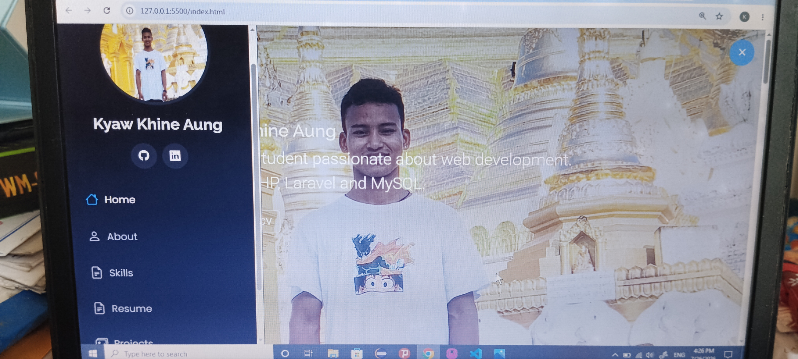

# 🌐 Kyaw Khine Aung - Portfolio

My personal portfolio website showcasing my skills, projects, education, and contact information.

## 🚀 Live Demo

🔗 https://kyaw-khine-aung-portfolio.netlify.app

## 📌 Features

- Responsive design for desktop, tablet, and mobile
- About Me section
- Technical Skills
- Resume
- Projects with Live Demo & GitHub links
- Contact Information
- Download CV button
- Smooth scrolling navigation
- Modern and clean UI

## 🛠️ Built With

- HTML5
- CSS3
- Bootstrap 5
- JavaScript
- Bootstrap Icons
- AOS (Animate On Scroll)

## 📂 Project Structure

```
Portfolio/
│
├── assets/
│   ├── css/
│   ├── js/
│   ├── img/
│   └── vendor/
│
├── index.html
├── .gitignore
└── README.md
```

## 📸 Screenshot



```

## 📁 Featured Projects

### PHP Authentication System
A user authentication system built with PHP and MySQL.
It includes user registration, login, password hashing, profile editing, and authentication features.

**Technologies:** PHP, MySQL, HTML, CSS, Bootstrap

**GitHub**
- 🔗 https://github.com/Kyaw-Khine-Aung-ucss/php-authentication-system

---

### 🌦️ Weather App

Responsive weather application using OpenWeather API.

**Live Demo**
https://kyaw-khine-weather-app.netlify.app

**GitHub**
https://github.com/Kyaw-Khine-Aung-ucss/weather-app

---

### ✅ To-Do List App

Task management application with Local Storage support.

**Live Demo**
https://kyaw-khine-aung-todo-list.netlify.app

**GitHub**
https://github.com/Kyaw-Khine-Aung-ucss/to-do-list

## 👨‍💻 Author

**Kyaw Khine Aung**

- GitHub: https://github.com/Kyaw-Khine-Aung-ucss
- LinkedIn: https://www.linkedin.com/in/kyaw-khine-aung-025972424/
- Email: kyawkhineaung.ucss@gmail.com

## 📄 License

This project is for educational and portfolio purposes.
```
